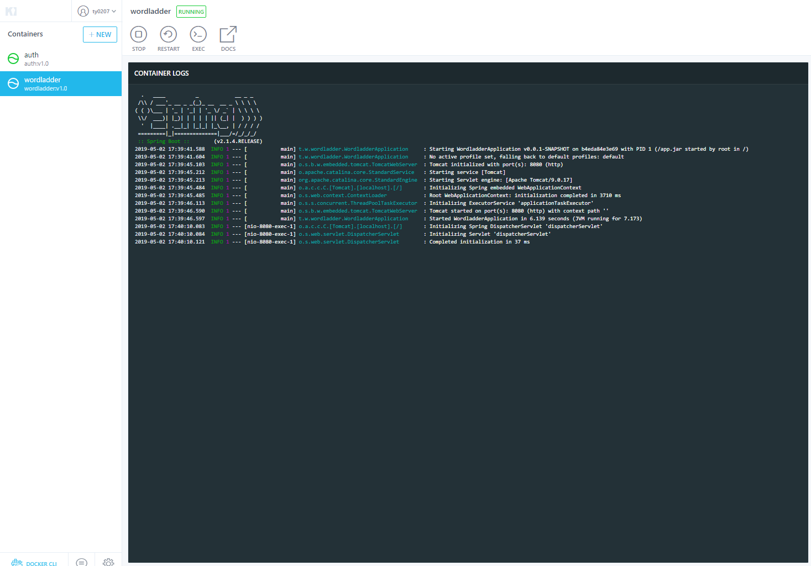
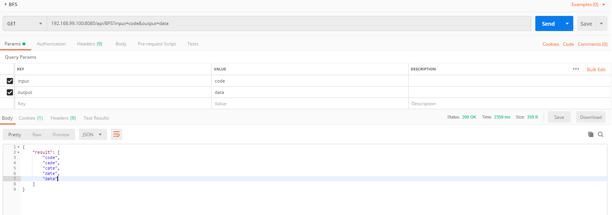

# microservice

本次作业意在使用原生Docker实现微服务，主要是为了完成拆分这个任务。

## structure


向用户暴露的应当只有auth的相关接口，有关wordladder service的调用需要auth service做一层proxy，先进行用户检查，或者可以进一步将auth service抽象成为gateway，整体的进行管理流量的导向，用户的检查。

## deploy

```bash
docker pull ty0207/wordladder:v1
docker pull ty0207/auth:v1

docker run -itd -P --name=wordladder ty0207/word-ladder:v1.0
docker run -itd -p 8080:8080 --link=wordladder:wordladder ty0207/auth:v1.0
```



## test

成功登陆后进行wordladder功能的使用，能够获得正确的结果。




未登陆想直接使调用auth代理的相应wordladder服务，不成功。

