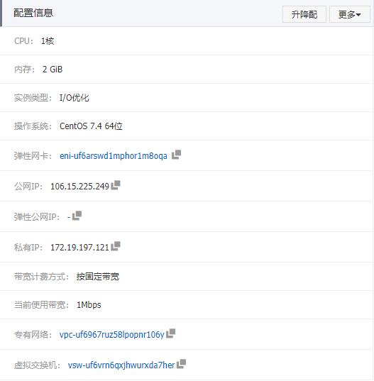
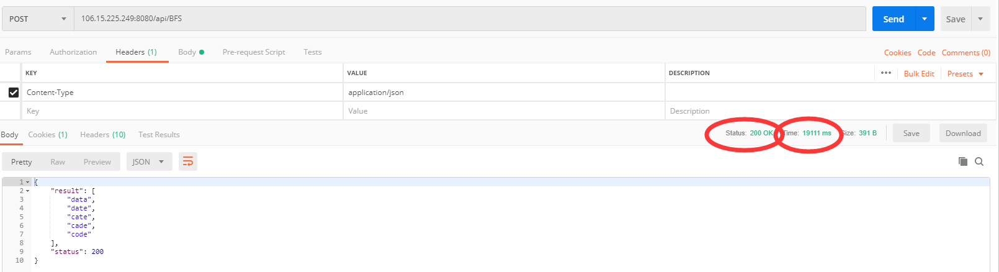
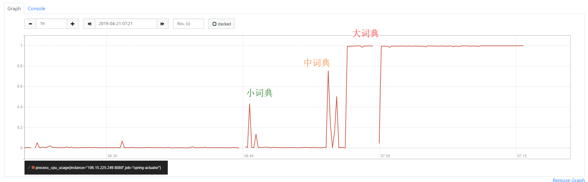
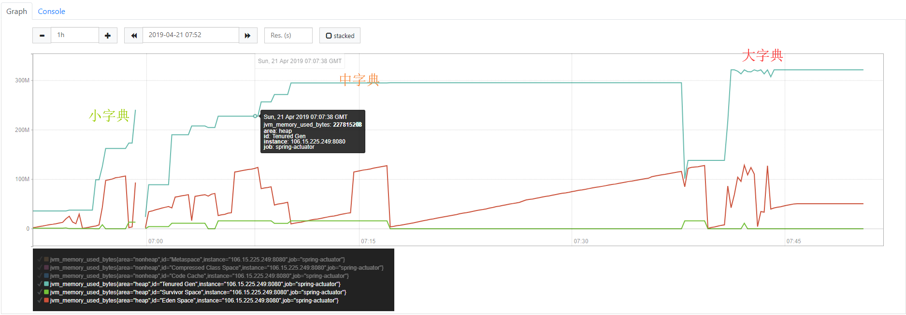
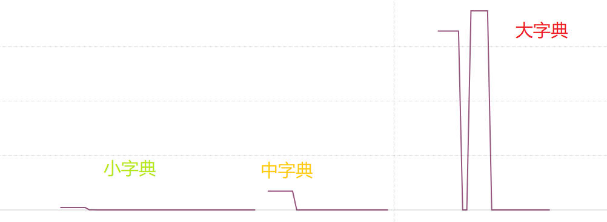
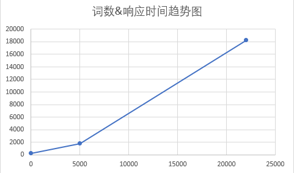
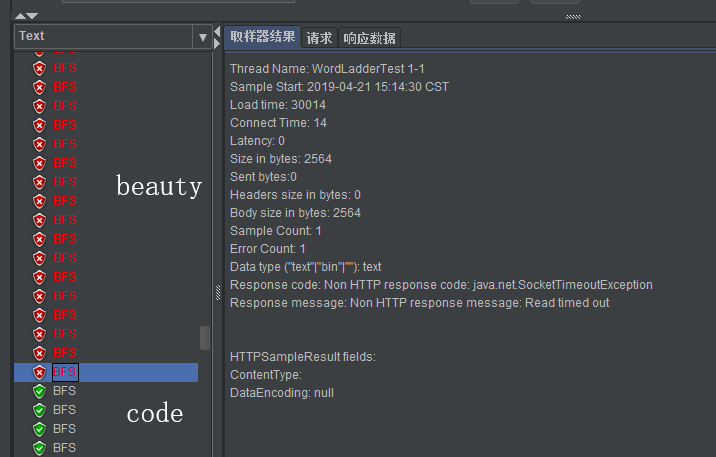
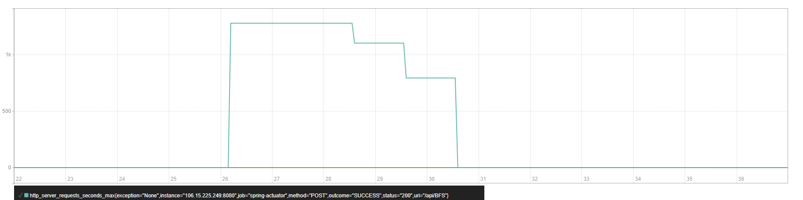

# Monitor Service by Prometheus

## deployment environment

aliyun student service  IP:106.15.225.249




## deploy spring-boot project & prometheus

```bash
mvn package spring-boot:repackage
# get the jar package in the target about 20MB, then we move it to server
java -jar xxx.jar
docker pull prom/prometheus
docker run -p 9090:9090 -d -v ~/prometheus.yml:/etc/prometheus/prometheus.yml prom/prometheus
```

## Using Postman and JMeter to test



我们发现仅仅单个请求的相应时间已经非常长了，主要原因是在于阿里云的学生服务器的性能着实是太低，在使用docker启动promethues之后，cpu-usage提升20%。

### use dictionaries of different size

我们使用大中小三种不同的字典，我们对其cpu-usage, memory, response time 进行了评估

cpu-useage:



非常明显的发现我们的cpu-usage随着字典大小而上升。

memory:



我们的蓝色线条是Tenured Gen，砖红色是Eden Space， 绿色为Survivor Space，GC会在一段时间内去Eden Space里面去询问，并进行回收，所以砖红色的线条抖动的情况最为严重。整体来讲memory随着字典大小而上升。



小字典的词数为10，平均响应时间为222ms，中词典的词数为5000左右，平均响应时间为1784ms，大辞典的词数为22000左右，响应时间为18280ms



### request with different input

上述的测试我们的输入和输出均是以data作为开始，code作为结尾进行的，我们探索出一个特殊情况，即strong作为开始，beauty作为结尾，我们使用JMeter进行测试，发现strong->beauty的情况下，在一段时间后，server直接拒绝了返回response。



我们最后使用data->code进行测试，发现一个神奇的下降趋势：



最初我认为这是cache的原因，查阅了相关的资料后发现，这应该是JMeter模拟的正常现象，我们设置的是每个thread循环五次请求。在测试最开始，我们的是直接开启所有的thread几乎进行了同时访问，服务器的负载基本稳定在100%，之后部分的请求在后期结束，则服务器的负载会有些下降，越到测试的后期，部分thread已经结束生命周期，则响应的平均时间会有所下降。