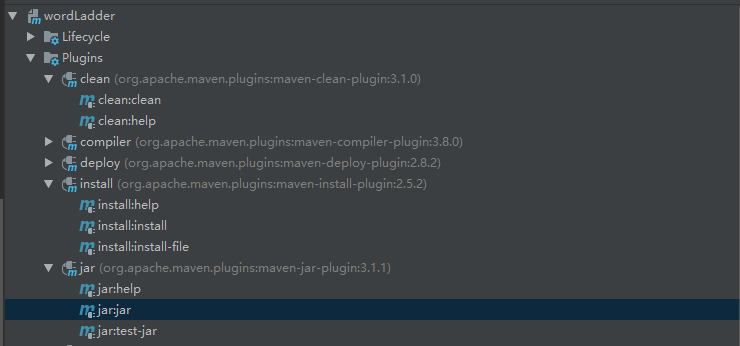
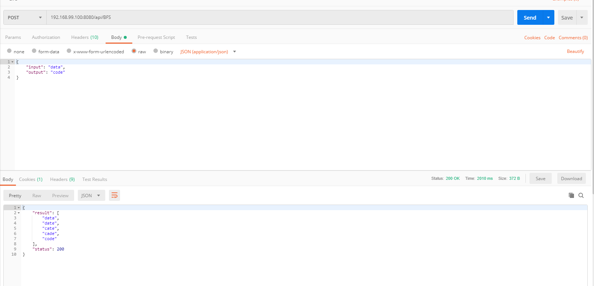

# docker deploy wordladder

## find a origin jdk mirror

使用 openjdk:8-jdk-alpine

## edit Dockerfile

```dockerfile
FROM openjdk:8-jdk-alpine
MAINTAINER TY
EXPOSE 8080
COPY ./wordladder.jar /wordladder.jar #方便助教改直接拷贝进去了，更好的肯定是设置Volume
ENTRYPOINT [ "java", "-jar", "/wordladder.jar" ]
```

### get ready for jar package

use IDEA to make a jar package



the package is in the target, then copy the package to Dockerfile's path

### build image

```bash
docker build -t wordladder:v1.0 .
```

### create container

```bash
docker run wordladder:v1.0 -p 8080:8080
```

### vertify the deploy



the IP = 192.168.100 because we use docker in Windows, actually containers run in the virtual machine.

### public the image

[public image](https://hub.docker.com/r/ty0207/wordladder)

