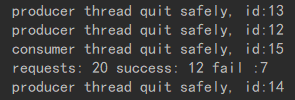

# consumer & producer

## 职能

consumer 负责向LinkedBlockingDeque中添加request，request中包含时间戳和需要的数量，worker这边一共有三个职能：

1. 维护一个原子量，表示为总库存
2. 处理request
3. 清楚掉时间过长的request

整个过程会有相应的打印，我们将会统计一个被清除量，请求量，处理量

 ## 策略

因为我们的deque的数量限制是10，我们规定在小于五的情况下使用FIFO，在大于五的情况下使用FILO