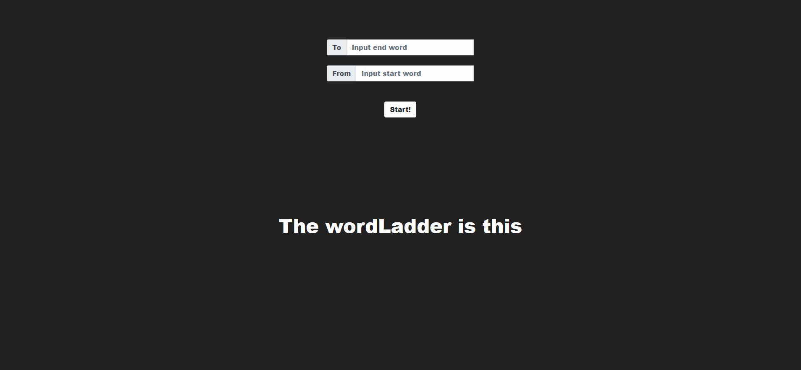
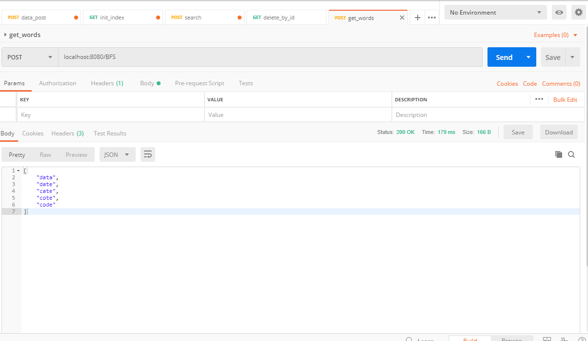
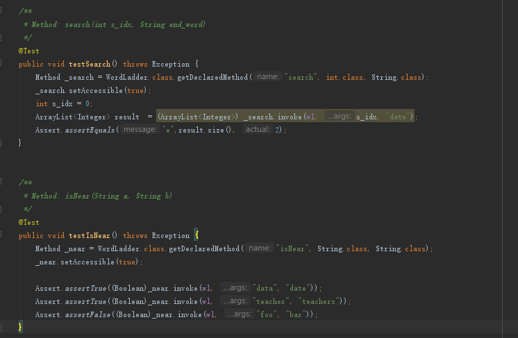
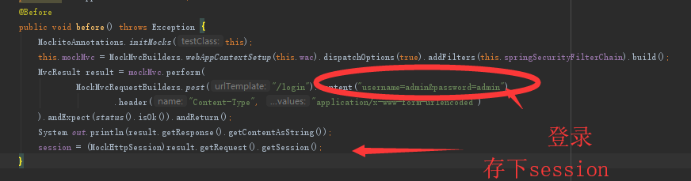
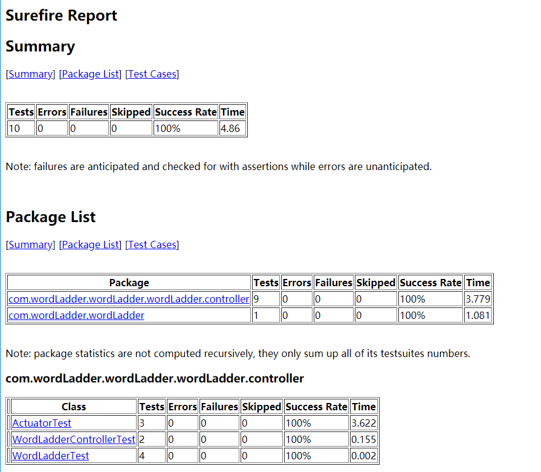

# WordLadder 

> name 谭骁
>
> ID 516110910019

## Display

一定要先开后端，因为前端默认也是8080端口

```bash
# start spring back-end
cd backend
mvn spring-boot:run
# start front-end
npm install 
http-server
```

## Project Architecture 

Briefly introduce the important documents in the project

- app.js

  back end entry file, using Express and WordLadder class to achieve the back end 

- test.js

  test file, test API and page

- wordladder.js

  the implement of class WordLadder

- dictionary.json

  the raw dictionary data

- test.json

  the dictionary data for test

- private.css

  Custom CSS storage here

- wordshow.js

  the important component to show the ladder

- index.html

  The home page, which contains ajax and JS for page dynamic adjustment 

- mochawesome-report

  store the beautified test report

- coverage

  store the beautified coverage report

- backend

  Spring Boot back-end

## Run Test

- Test correctness, run code `npm test`, then you can check the report at **mochawesome-report**
- Test coverage，run code`npm coverage`, then you can check the report at **coverage**

PS : E2E test may wrong because the production environment need special settings(web-driver)

## Feature

1. Express is used as the back end, jQuery library is used in the front end, and the back end is separated
2. It has a validate module at front end
3. Ajax make the page partial refresh

## New backend implemented by Spring Boot

the Spring Boot Backend is in the path of the backend, the front-end just has tiny modify.



## About Junit

WordLadder uses Junit to test the back-end project, which has a two-level test plan:

1. web level

   the purpose of web-level test is to check whether http requests are right and the CORS problem has been solved.

2. wordladder level

   Make sure the application(word ladder kernel) is correct.

the backend test file is in backend/src/test


```bash
# run test
.\mvnw clean test
```

## 2019/04/07 About Restful Controller



我们在v0.1中基本实现了相关的RestFul接口，如上图postman所示。

此外我们添加了使用反射机制调用private函数进行白盒测试的相关测试函数，新增了测试报告

`mvn test surefire-report:report`之后将在target/site中出现相应的report




### 关于dictionary

我们字典都存在resources/static中


### 新增Actuator & ActuatorTest

actuator 所有的endpoint都开启，详见配置文件，我们仅针对其中三个进行了测试，其余的用postman进行了分析观察，由于太繁琐我们就不进行测试了。

Acrtuator的所有接口都必须是ADMIN的role才能进行，而其他的功能性接口是只需要用户登录即可使用，我们在Test的before中专门进行了登录。



report:

